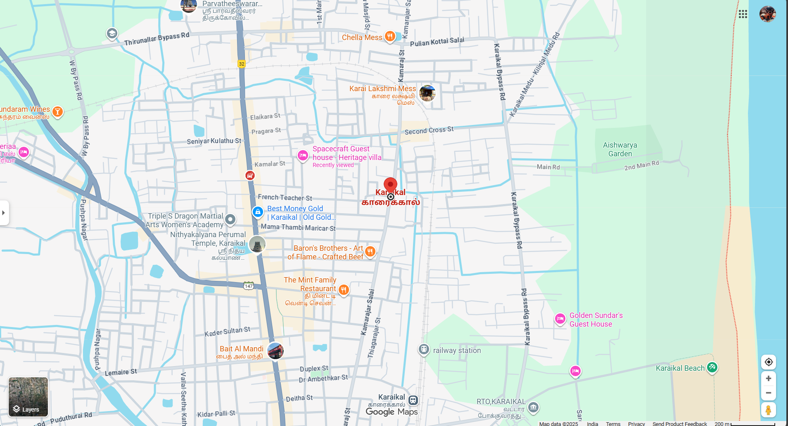

# Ex04 Places Around Me
## Date:23/10/2025

## AIM
To develop a website to display details about the places around my house.

## DESIGN STEPS

### STEP 1
Create a Django admin interface.

### STEP 2
Download your city map from Google.

### STEP 3
Using ```<map>``` tag name the map.

### STEP 4
Create clickable regions in the image using ```<area>``` tag.

### STEP 5
Write HTML programs for all the regions identified.

### STEP 6
Execute the programs and publish them.

## CODE
## 1.sample.html
<html>
<head>
    <title>My City</title>
</head>
<body>
    <h1 align="center">
        <font color="red"><b>KARAIKAL</b></font>
    </h1>
    <h3 align="center">
        <font color="blue"><b>ARAVINDAN SD (25005593)</b></font>
    </h3>
    <center>
        
        <map name="MyCity">
            <area shape="rect" coords="700,250,770,300" href="home.html" title="My Home Town">
            <area shape="rect" coords="300,200,600,500" href="temple.html" title="Nithayakalana perumal temple Karaikal">
            <area shape="rect" coords="100,150,400,900" href="beach.html" title="Karaikal Beach">
            <area shape="rect" coords="450,200,100,900" href="temple2.html" title="Sri Parvatheeswarar temple">
            <area shape="rect" coords="600,450,800,200" href="train.html" title="Karaikal Railway Station">

        </map>
    </center>
</body>
</html>

## 2.home.html
<html>
<head>
<title>My Home Town</title>
</head>
<body bgcolor="lightblue">
<h1 align="center">
<font color="red"><b>KARAIKAL</b></font>
</h1>
<h3 align="center">
<font color="darkgreen"><b>My Home Town</b></font>
</h3>
<hr size="3" color="red">
<p align="justify">
<font face="Georgia" size="5">
Karaikal is a port city of the Indian Union Territory of Puducherry.It is the administrative headquarters of the Karaikal District and the second most populated town in the Union Territory after Pondicherry.
Located on the Coromandel Coast of Bay of Bengal in South India, it is situated at the center of a coastal enclave surrounded by the state of Tamil Nadu and its Cauvery delta districts (Mayiladuthurai, Tiruvarur and Nagapattinam).
</font>
</p>
</body>
</html>

## 3.temple.html
<html>
<head>
<title>My Home Town</title>
</head>
<body bgcolor="pink">
<h1 align="center">
<font color="red"><b>KARAIKAL</b></font>
</h1>
<h3 align="center">
<font color="blue"><b>Nithayakalana perumal temple Karaikal - Devotional Centre</b></font>
</h3>
<hr size="3" color="red">
<p align="justify">
<font face="Georgia" size="5">
Nithyakalyana Perumal Temple is one of three famous temples in the port city of Karaikal, Puducherry, India.
It is nearby the Karaikal Ammayar Temple.
The temple tank of Chandra Theertham separates the two temples.
The temple tank belongs to both the temples.
The Nithyakalyana Perumal temple is located on the Bharathiar Street of Karaikal.<br><br>
Deities inside the temple:<br><br>
The temple is a Vishnu temple with the idol of Vishnu in a lying posture named Nithyakalyana Perumal. He is the main god of the temple.
The Nithyakalyana Perumal sanctum is present in the temple. In the praghara, there are many sanctums for the gods:<br><br>

*Chakkarathazhwar<br>
*Ranganayaghi Thayar<br>
*Narasimha avatar of Lord Vishnu<br>
*Hanuman<br>
*Avatars of Lord Vishnu<br>
*Lord Krishna's Vishwaroopam<br>
*Lord Garuda<br>
*Aandal<br>
*Alamelu Thayaar<br>
</font>
</p>
</body>
</html>

## 4.temple2.html
<html>
<head>
<title>My Home Town</title>
</head>
<body bgcolor="orange">
<h1 align="center">
<font color="brown"><b>KARAIKAL</b></font>
</h1>
<h3 align="center">
<font color="blue"><b>Sri Parvatheeswarar temple - Devotional Centre</b></font>
</h3>
<hr size="3" color="red">
<p align="justify">
<font face="Georgia" size="5">
At a distance of 2.5 km from Karaikal Railway Station, Sri Parvatheeswara Swami Temple is situated on Thirunallar road near Pondicherry University.<br><br>

This temple is dedicated to Lord Parvatheeswara, an incarnation of Lord Shiva. This is a west facing temple and represents Chola architectural style. It is believed to be built around the 8th century, during the reign of Pallavas but the temple was thought to be reconstructed during the period of the Cholas.
The site is one of the four places in Karaikal region visited by Thirugnanasambandar, a saint who sang Pathigam in honour of Sri Parvatheeswara Swami. The temple celebrates Vijayadasami, Kadaimuzhukku, Thiruvadhirai and Surasamharam festivals.
</font>
</p>
</body>
</html>

## 5.beach.html
<html>
<head>
<title>My Home Town</title>
</head>
<body bgcolor="yellow">
<h1 align="center">
<font color="red"><b>KARAIKAL</b></font>
</h1>
<h3 align="center">
<font color="blue"><b>Karaikal Beach</b></font>
</h3>
<hr size="3" color="red">
<p align="justify">
<font face="Georgia" size="5">
Karaikal Beach is a popular beach in the coastal area of Karaikal city, Puducherry, India.
It lies on the Bay of Bengal. The beach is one of the best natural beaches in the region of Southeastern Tamil Nadu.<br><br>
The Arasalar River forms the estuary near Karaikal Beach. The beach is two kilometers wide. Its accessibility has been made easier by widening the road along the Arasalar River and illumination by sodium vapour lamps.
To attract the locals and outside tourists, fountains, children's parks, restaurants and tennis courts have been constructed in the area. Due to these, the Karaikal beach attracts a heavy crowd of people each day.
</font>
</p>
</body>
</html>

## 6.train.html
<html>
<head>
<title>My Home Town</title>
</head>
<body bgcolor="grey">
<h1 align="center">
<font color="purple"><b>KARAIKAL</b></font>
</h1>
<h3 align="center">
<font color="lightblack"><b>Railway Station</b></font>
</h3>
<hr size="3" color="red">
<p align="justify">
<font face="Georgia" size="5">
Karaikal railway station (station code: KIK) is an NSG-4 category Indian railway station in Tiruchirappalli railway division of Southern Railway zone.
It is a railway terminus, situated in the city of Karaikal in the Union Territory of Puducherry, India. The station is 145 kilometres (90 mi) east of Tiruchirappalli and 300 kilometres (190 mi) from Chennai and connects Karaikal to various parts of the country.<br><br>

Location and layout:<br><br>
The railway station is located on Railway station road off the East Coast Road (ECR) and the Karaikal Bypass Road. The Karaikal Bus Station is located 3 kilometres (1.9 mi) away. The nearest airport is Tiruchirappalli International Airport, situated at about 130 kilometres (81 mi) away from the station. Karaikal Port is located 11 kilometres (6.8 mi) from Karaikal railway station.
</font>
</p>
</body>
</html>


## OUTPUT



## RESULT
The program for implementing image maps using HTML is executed successfully.
